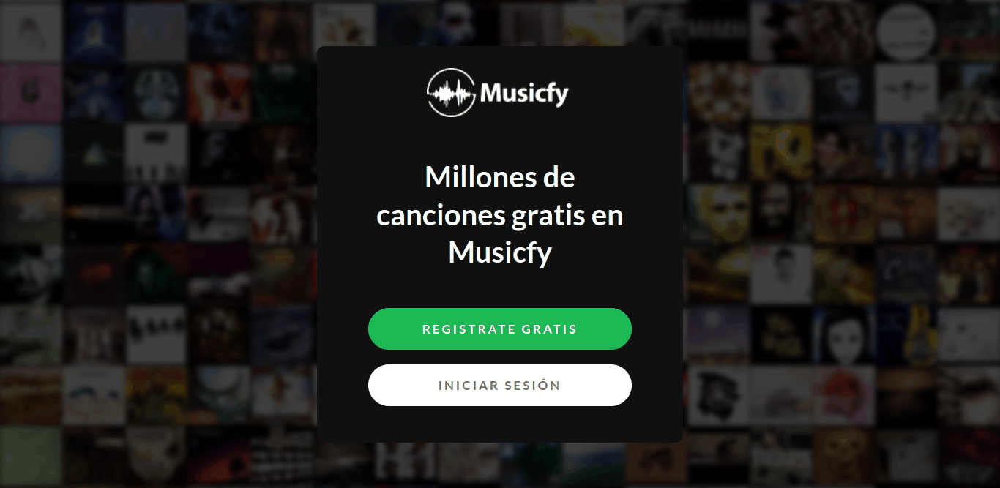

# Musicfy | Millions of Free Songs 

This application is a small clone of Spotify, it doesn't have all features because it is to practice my React knowledge.

The application is development yet.

## Table of contents

- [Overview](#overview)
  - [Features](#features)
  - [Screenshot](#screenshot)
  - [Links](#links)
- [My process](#my-process)
  - [Built with](#built-with)
  - [Continued development](#continued-development)
- [Author](#author)

## Overview

### Features

<!-- Add features of the app here -->

### Screenshot

### Links

<!-- - Live Site URL: [Add live site URL here](https://your-live-site-url.com) -->

## My process

### Built with

- [React](https://reactjs.org/) - JS library
- [Electron](https://www.electronjs.org/docs/latest) - Js Framework
- [React Router](https://reactrouter.com/docs/en/v6/getting-started/overview) - React Library 
- [Semantic UI Library](https://react.semantic-ui.com/) - React Library
- [Toastify](https://fkhadra.github.io/react-toastify/introduction) - React Library
- [Sass](https://sass-lang.com/documentation/) - Stylesheet language 
- [Firebase](https://firebase.google.com/) - Google Plataform 

### Continued development

1. When playing a song, show the lyrics of a API, or upload it by own user.
2. Can play music of your computers when the app is offline( it will not has auth )

## Author

- Website - [Carlos Manuel](https://cmglezpdev.vercel.app/)
- Twitter - [@cmglezpdev](https://www.twitter.com/cmglezpdev)
